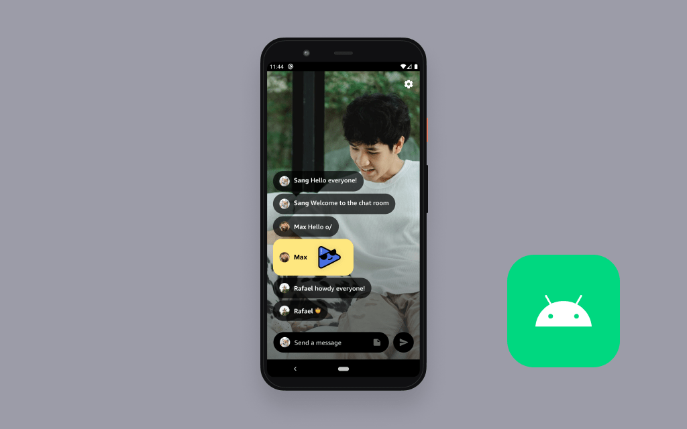

# Amazon IVS Chat for Android Demo

A demo Android phone application intended for use as an educational tool to demonstrate how a simple live video and chat application can be built with Amazon IVS video and chat.

**This project is intended for education purposes only and not for production usage.**

The demo showcases how you can implement a simple live streaming application with video and chat using Amazon IVS. Viewers are asked to enter their name the first time they begin chatting. Chat users can send plain text messages, emojis, and stickers. Chat moderators can delete messages and kick users.

## Prerequisites

* The `ApiUrl` from a deployed [Amazon IVS Chat Demo Backend](https://github.com/aws-samples/amazon-ivs-chat-web-demo/tree/main/serverless).

## Setup

To open the demo Android app, follow these instructions:

1. Clone this repository to your local machine
2. Open `app/build.gradle` file and set constants for:
    * Amazon IVS Playback URL `STREAM_URL`
        * A sample playback url for a 24/7 livestream is pre-filled. You may add a playback url to use a custom livestream in this demo.
    * Amazon IVS Chat Demo backend endpoint `API_URL`
        * You must deploy the [Amazon IVS Chat Demo Backend](https://github.com/aws-samples/amazon-ivs-chat-web-demo/tree/main/serverless) to get this value.
    * Chat websocket address `SOCKET_URL`
        * The websocket endpoint for the chat room: `wss://edge.ivschat.<aws-region>.amazonaws.com`. 
        * For example, if your chat room is located in `us-west-2`, the websocket endpoint would be `wss://edge.ivschat.us-west-2.amazonaws.com`.
    * Chat room id `CHAT_ROOM_ID`
        * The ID (or ARN) of the Amazon IVS Chat Room that the app should use.
        * You must create an Amazon IVS Chat Room to get a chat room ID/ARN. Refer to [Getting Started with Amazon IVS Chat](https://docs.aws.amazon.com/ivs/latest/userguide/getting-started-chat.html) for a detailed guide.
3. Build and install the `.apk` on your device / emulator

## Known issues and limitations
* The application is meant for demonstration purposes and **not** for production use.
* This application is only tested in the us-west-2 (Oregon) region. Additional regions may be supported depending on service availability.

## About Amazon IVS
Amazon Interactive Video Service (Amazon IVS) is a managed live streaming and stream chat solution that is quick and easy to set up, and ideal for creating interactive video experiences. [Learn more](https://aws.amazon.com/ivs/).

* [Amazon IVS docs](https://docs.aws.amazon.com/ivs/)
* [User Guide](https://docs.aws.amazon.com/ivs/latest/userguide/)
* [API Reference](https://docs.aws.amazon.com/ivs/latest/APIReference/)
* [Setting Up for Streaming with Amazon Interactive Video Service](https://aws.amazon.com/blogs/media/setting-up-for-streaming-with-amazon-ivs/)
* [Learn more about Amazon IVS on IVS.rocks](https://ivs.rocks/)
* [View more demos like this](https://ivs.rocks/examples)

## Security

See [CONTRIBUTING](CONTRIBUTING.md#security-issue-notifications) for more information.

## License

This library is licensed under the MIT-0 License. See the LICENSE file.